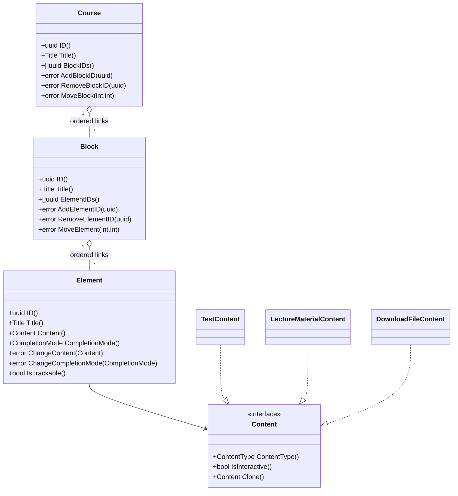

# Course Module Class Diagram

```mermaid
classDiagram
    class Course {
      +uuid ID()
      +Title Title()
      +[]uuid BlockIDs()
      +error AddBlockID(uuid)
      +error RemoveBlockID(uuid)
      +error MoveBlock(int,int)
    }

    class Block {
      +uuid ID()
      +Title Title()
      +[]uuid ElementIDs()
      +error AddElementID(uuid)
      +error RemoveElementID(uuid)
      +error MoveElement(int,int)
    }

    class Element {
      +uuid ID()
      +Title Title()
      +Content Content()
      +CompletionMode CompletionMode()
      +error ChangeContent(Content)
      +error ChangeCompletionMode(CompletionMode)
      +bool IsTrackable()
    }

    class Content {
      <<interface>>
      +ContentType ContentType()
      +bool IsInteractive()
      +Content Clone()
    }

    class TestContent
    class LectureMaterialContent
    class DownloadFileContent

    Course "1" o-- "*" Block : ordered links
    Block "1" o-- "*" Element : ordered links
    Element --> Content
    TestContent ..|> Content
    LectureMaterialContent ..|> Content
    DownloadFileContent ..|> Content
```
