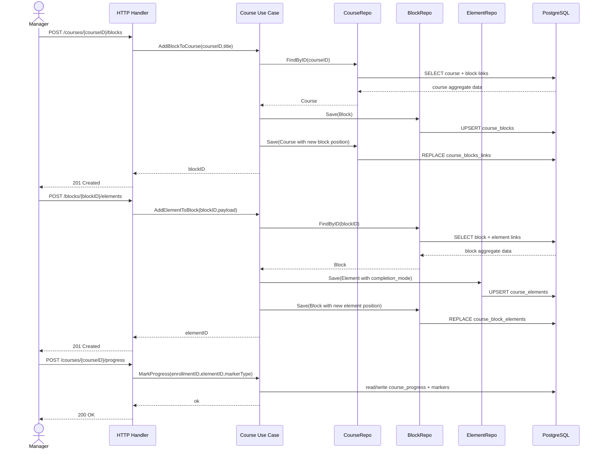

# Course Module Sequence Diagram

```mermaid
sequenceDiagram
    actor Manager
    participant HTTP as HTTP Handler
    participant UC as Course Use Case
    participant CR as CourseRepo
    participant BR as BlockRepo
    participant ER as ElementRepo
    participant DB as PostgreSQL

    Manager->>HTTP: POST /courses/{courseID}/blocks
    HTTP->>UC: AddBlockToCourse(courseID,title)
    UC->>CR: FindByID(courseID)
    CR->>DB: SELECT course + block links
    DB-->>CR: course aggregate data
    CR-->>UC: Course
    UC->>BR: Save(Block)
    BR->>DB: UPSERT course_blocks
    UC->>CR: Save(Course with new block position)
    CR->>DB: REPLACE course_blocks_links
    UC-->>HTTP: blockID
    HTTP-->>Manager: 201 Created

    Manager->>HTTP: POST /blocks/{blockID}/elements
    HTTP->>UC: AddElementToBlock(blockID,payload)
    UC->>BR: FindByID(blockID)
    BR->>DB: SELECT block + element links
    DB-->>BR: block aggregate data
    BR-->>UC: Block
    UC->>ER: Save(Element with completion_mode)
    ER->>DB: UPSERT course_elements
    UC->>BR: Save(Block with new element position)
    BR->>DB: REPLACE course_block_elements
    UC-->>HTTP: elementID
    HTTP-->>Manager: 201 Created

    Manager->>HTTP: POST /courses/{courseID}/progress
    HTTP->>UC: MarkProgress(enrollmentID,elementID,markerType)
    UC->>DB: read/write course_progress + markers
    UC-->>HTTP: ok
    HTTP-->>Manager: 200 OK
```
