# Диаграмма классов домена Question

```mermaid
classDiagram
    direction TB

    %% ═══════════════════════════════════════════
    %% CORE INTERFACES
    %% ═══════════════════════════════════════════
    class Question {
        <<interface>>
        +ID() uuid
        +Title() Title
        +Instruction() string
        +Type() Type
        +Clone() Question
        +ChangeTitle(Title) error
    }
    class Answer {
        <<interface>>
        +IsEmpty() bool
        +Clone() Answer
    }
    class Checker {
        <<interface>>
        +Check(Question, Answer) Score
        +Supports(Type) bool
    }
    class AnswerValidator {
        <<interface>>
        +Validate(Question, Answer) error
    }
    class Checker {
        <<interface>>
        +Check(Question, Answer) Score
        +Supports(Type) bool
    }

    %% ═══════════════════════════════════════════
    %% ENUMERATIONS
    %% ═══════════════════════════════════════════
    class Type {
        <<enumeration>>
        selectable
        matching
        sequence
        short
        +IsValid() bool
        +Title() string
        +DefaultInstruction() string
    }
    class Status {
        <<enumeration>>
        in_progress
        finished
        expired
        interrupted
        cancelled
        +IsValid() bool
        +Title() string
    }

    %% ═══════════════════════════════════════════
    %% BASE ENTITY & VALUE OBJECTS
    %% ═══════════════════════════════════════════
    class Base {
        -id uuid
        -title Title
        +ID() uuid
        +Title() Title
        +ChangeTitle(Title) error
        +Clone() Base
    }
    class Title {
        -value string
        ~max 1000 chars
        +New(string) Title
        +Value() string
        +IsZero() bool
    }
    class Score {
        -value float64 [0..1]
        +New(float64) Score
        +Value() float64
    }

    %% ═══════════════════════════════════════════
    %% QUESTION AGGREGATES (by type)
    %% ═══════════════════════════════════════════
    class MatchingQuestion {
        -pairs []Pair
        +Pairs() []Pair
        +Type() TypeMatching
        +ChangePairs([]Pair) error
        +Clone() MatchingQuestion
    }
    class SelectableQuestion {
        -options []Option
        +Options() []Option
        +CorrectOptionsCount() int
        +Type() TypeSelectable
        +ChangeOptions([]Option) error
        +Clone() SelectableQuestion
    }
    class SequenceQuestion {
        -options []Option
        +Options() []Option
        +Type() TypeSequence
        +ChangeOptions([]Option) error
        +Clone() SequenceQuestion
    }
    class ShortQuestion {
        -variants []Variant
        +Variants() []Variant
        +Type() TypeShort
        +ChangeVariants([]Variant) error
        +Clone() ShortQuestion
    }

    %% ═══════════════════════════════════════════
    %% QUESTION VALUE OBJECTS
    %% ═══════════════════════════════════════════
    class Prompt {
        -id uuid
        -value string ~max 255
        +ID() uuid
        +Value() string
    }
    class Match {
        -id uuid
        -value string ~max 255
        +ID() uuid
        +Value() string
    }
    class Pair {
        -prompt Prompt
        -match Match
        +Prompt() Prompt
        +Match() Match
        +PromptID() uuid
        +MatchID() uuid
    }
    class SelectableOption {
        -id uuid
        -value string ~max 255
        -isCorrect bool
        +ID() uuid
        +Value() string
        +IsCorrect() bool
    }
    class SequenceOption {
        -value string ~max 255
        +Value() string
    }
    class Variant {
        -value string ~max 1000
        +Value() string
    }

    %% ═══════════════════════════════════════════
    %% ANSWER TYPES (by question type)
    %% ═══════════════════════════════════════════
    class MatchingAnswer {
        -pairs []AnswerPair
        +Pairs() []AnswerPair
        +AsMap() map~uuid~uuid~
        +IsEmpty() bool
        +Clone() Answer
    }
    class MatchingAnswerPair {
        +PromptID uuid
        +MatchID uuid
    }
    class SelectableAnswer {
        -optionIDs []uuid
        +OptionIDs() []uuid
        +OptionIDSet() map~uuid~struct~
        +IsEmpty() bool
        +Clone() Answer
    }
    class SequenceAnswer {
        -optionIDs []OptionID
        +OptionIDs() []OptionID
        +IsEmpty() bool
        +Clone() Answer
    }
    class SequenceOptionID {
        -id uuid
        +ID() uuid
    }
    class ShortAnswer {
        -value string
        +Value() string
        +IsEmpty() bool
        +Clone() Answer
    }

    %% ═══════════════════════════════════════════
    %% ATTEMPT AGGREGATE (aggregate root)
    %% ═══════════════════════════════════════════
    class Attempt {
        -id uuid
        -enrollmentID uuid
        -quizID uuid
        -status Status
        -startedAt time.Time
        -deadlineAt time.Time
        -finishedAt time.Time
        -items []Item
        -answers map~uuid~Entry
        +ID() uuid
        +Status() Status
        +CanModify() bool
        +AddAnswer(uuid, Answer, time) error
        +Finish(time) error
        +SetExpired(time) error
        +Interrupt(time) error
        +Cancel(time) error
        +Items() []Item
        +Answers() map~uuid~Entry
    }
    class Item {
        -snapshot Question
        +ID() uuid
        +Snapshot() Question
    }
    class Entry {
        -questionID uuid
        -answer Answer
        -answeredAt time.Time
        +QuestionID() uuid
        +Answer() Answer
        +AnsweredAt() time.Time
    }

    %% ═══════════════════════════════════════════
    %% GRADING CHECKERS (domain services)
    %% ═══════════════════════════════════════════
    class MatchingChecker {
        +Check(Question, Answer) Score
        +Supports(Type) bool
    }
    class SelectableChecker {
        +Check(Question, Answer) Score
        +Supports(Type) bool
    }
    class SequenceChecker {
        +Check(Question, Answer) Score
        +Supports(Type) bool
    }
    class ShortChecker {
        -normalizers []normalizer
        +Check(Question, Answer) Score
        +Supports(Type) bool
    }

    %% ═══════════════════════════════════════════
    %% ANSWER VALIDATORS (domain services)
    %% ═══════════════════════════════════════════
    class MatchingValidator {
        +Validate(Question, Answer) error
    }
    class SelectableValidator {
        +Validate(Question, Answer) error
    }
    class SequenceValidator {
        +Validate(Question, Answer) error
    }
    class ShortValidator {
        +Validate(Question, Answer) error
    }

    %% ═══════════════════════════════════════════
    %% CHECKER REGISTRY (domain service)
    %% ═══════════════════════════════════════════
    class CheckerRegistry {
        -checkers map~Type~Checker
        +New(map~Type~Checker) Registry
        +Get(Type) Checker
    }

    %% ═══════════════════════════════════════════
    %% APPLICATION LAYER
    %% ═══════════════════════════════════════════
    class GradeUseCase {
        -repo Repository
        -registry Registry
        -validators map~Type~AnswerValidator
        +Execute(ctx, GradeInput) GradeOutput
    }
    class ValidateAnswerUseCase {
        -repo Repository
        -validators map~Type~AnswerValidator
        +Execute(ctx, ValidateAnswerInput) error
    }

    %% ═══════════════════════════════════════════
    %% RELATIONSHIPS
    %% ═══════════════════════════════════════════

    %% ── Interface implementations ──
    Question  <|.. MatchingQuestion    : implements
    Question  <|.. SelectableQuestion  : implements
    Question  <|.. SequenceQuestion    : implements
    Question  <|.. ShortQuestion       : implements

    Answer    <|.. MatchingAnswer      : implements
    Answer    <|.. SelectableAnswer    : implements
    Answer    <|.. SequenceAnswer      : implements
    Answer    <|.. ShortAnswer         : implements

    Checker   <|.. MatchingChecker     : implements
    Checker   <|.. SelectableChecker   : implements
    Checker   <|.. SequenceChecker     : implements
    Checker   <|.. ShortChecker        : implements

    AnswerValidator <|.. MatchingValidator    : implements
    AnswerValidator <|.. SelectableValidator  : implements
    AnswerValidator <|.. SequenceValidator    : implements
    AnswerValidator <|.. ShortValidator       : implements

    %% ── Embedding (composition) ──
    MatchingQuestion    *-- Base   : embeds
    SelectableQuestion  *-- Base   : embeds
    SequenceQuestion    *-- Base   : embeds
    ShortQuestion       *-- Base   : embeds

    Base                *-- Title  : has

    %% ── Question → Value Objects (ownership) ──
    MatchingQuestion    o-- Pair              : "pairs [2..20]"
    SelectableQuestion  o-- SelectableOption  : "options [2..20]"
    SequenceQuestion    o-- SequenceOption    : "options [2..20]"
    ShortQuestion       o-- Variant           : "variants [1..20]"

    Pair                *-- Prompt
    Pair                *-- Match

    %% ── Answer composition ──
    MatchingAnswer      o-- MatchingAnswerPair : "student pairs"
    SequenceAnswer      o-- SequenceOptionID   : "ordered IDs"

    %% ── Attempt composition ──
    Attempt  o-- Status : "lifecycle"
    Attempt  *-- Item   : "snapshots"
    Attempt  *-- Entry  : "answers map"

    Item     o-- Question  : "clones via Clone()"
    Entry    o-- Answer    : "clones via Clone()"

    %% ── Checker type assertions (runtime downcasting) ──
    MatchingChecker    ..> MatchingQuestion   : type-assert *MatchingQuestion
    MatchingChecker    ..> MatchingAnswer     : type-assert answer.Answer
    SelectableChecker  ..> SelectableQuestion : type-assert *SelectableQuestion
    SelectableChecker  ..> SelectableAnswer   : type-assert answer.Answer
    SequenceChecker    ..> SequenceQuestion   : type-assert *SequenceQuestion
    SequenceChecker    ..> SequenceAnswer     : type-assert answer.Answer
    ShortChecker       ..> ShortQuestion      : type-assert *ShortQuestion
    ShortChecker       ..> ShortAnswer        : type-assert answer.Answer

    %% ── Validator type assertions (runtime downcasting) ──
    MatchingValidator    ..> MatchingQuestion   : type-assert
    MatchingValidator    ..> MatchingAnswer     : type-assert
    SelectableValidator  ..> SelectableQuestion : type-assert
    SelectableValidator  ..> SelectableAnswer   : type-assert
    SequenceValidator    ..> SequenceQuestion   : type-assert
    SequenceValidator    ..> SequenceAnswer     : type-assert
    ShortValidator       ..> ShortQuestion      : type-assert
    ShortValidator       ..> ShortAnswer        : type-assert

    Checker            ..> Score              : returns
    CheckerRegistry    o-- Checker            : "map Type → Checker"

    %% ── Application wiring ──
    GradeUseCase           --> CheckerRegistry    : "Get(Type)"
    GradeUseCase           ..> AnswerValidator    : "validates before grading"
    GradeUseCase           ..> Question           : "loads via Repository"
    ValidateAnswerUseCase  ..> AnswerValidator    : "validates only (no scoring)"
    ValidateAnswerUseCase  ..> Question           : "loads via Repository"

    %% ── Type association ──
    Question  ..> Type
```

---

## Легенда

| Обозначение | Смысл |
|---|---|
| `<<interface>>` | Интерфейс (контракт) |
| `<<enumeration>>` | Перечисление (строковый тип с набором констант) |
| `<|--` | Реализация интерфейса |
| `*--` | Композиция (владение, жизненный цикл) |
| `o--` | Агрегация / слабая ссылка |
| `-->` | Зависимость / делегирование |
| `..>` | Runtime type assertion |

## Ключевые архитектурные решения

1. **Стратегия (Strategy)** — каждый конкретный тип вопроса (`matching`, `selectable`, `sequence`, `short`) реализует интерфейс `Question`. Соответственно, каждый тип ответа реализует `Answer`, каждый проверяющий — `Checker`, а каждый валидатор — `AnswerValidator`. Выбор стратегии происходит через `CheckerRegistry.Get(Type)` (O(1) map lookup) и `validators[Type]`.

2. **Разделение валидации и оценивания** — `AnswerValidator.Validate()` проверяет совместимость ответа с вопросом (nil-проверки, соответствие типов). `Checker.Check()` вычисляет score. `GradeUseCase` вызывает оба последовательно. `ValidateAnswerUseCase` вызывает только `AnswerValidator` — без wasteful score computation.

3. **CheckerRegistry** — заменяет O(n) перебор `Supports()` на O(1) map lookup. Валидирует отсутствие nil-checker'ов и неизвестных типов при создании. Возвращает понятную ошибку `ErrNotFound` при отсутствии checker'а для типа.

4. **Embedding вместо наследования** — все четыре конкретных типа вопроса встраивают (`embeds`) `*base.Base`, который содержит `id` и `title`. Это обеспечивает переиспользование общего состояния без классического наследования.

5. **Immutable snapshot в Attempt** — при создании `Attempt` каждый `Question` клонируется через `Clone()` и сохраняется в `Item` как snapshot. При добавлении ответа `Answer` также клонируется в `Entry`. Это гарантирует, что изменение вопроса преподавателем не повлияет на уже запущенные попытки.

6. **Runtime type assertions локализованы в domain-слое** — `Checker.Check()` и `AnswerValidator.Validate()` выполняют type assertions только внутри domain-пакетов. Application-слой (`GradeUseCase`, `ValidateAnswerUseCase`) не делает type assertions.

7. **Value Objects** — `Title`, `Prompt`, `Match`, `Pair`, `Option`, `Variant`, `Score` не имеют собственной идентичности; равенство определяется по значению. Содержат инварианты валидации (лимиты символов, диапазоны).

8. **Машина состояний Attempt** — `Status` управляет жизненным циклом попытки: `in_progress → finished | expired | interrupted | cancelled`. Метод `CanModify()` разрешает изменения только в статусе `in_progress`.

9. **SequenceOption без ID** — в отличие от `SelectableOption`, `SequenceOption` не имеет явного ID. Идентификатор вычисляется детерминированно через `uuid.NewSHA1` от значения опции во время проверки; это не позволяет студенту угадать правильный порядок по идентификаторам.

10. **Унифицированные sentinel errors** — `ErrInvalidQuestionType`, `ErrInvalidAnswerType`, `ErrNilQuestion`, `ErrNilAnswer` определены единожды в `domain/grading/errors.go` и переиспользуются всеми checker'ами и validator'ами.
